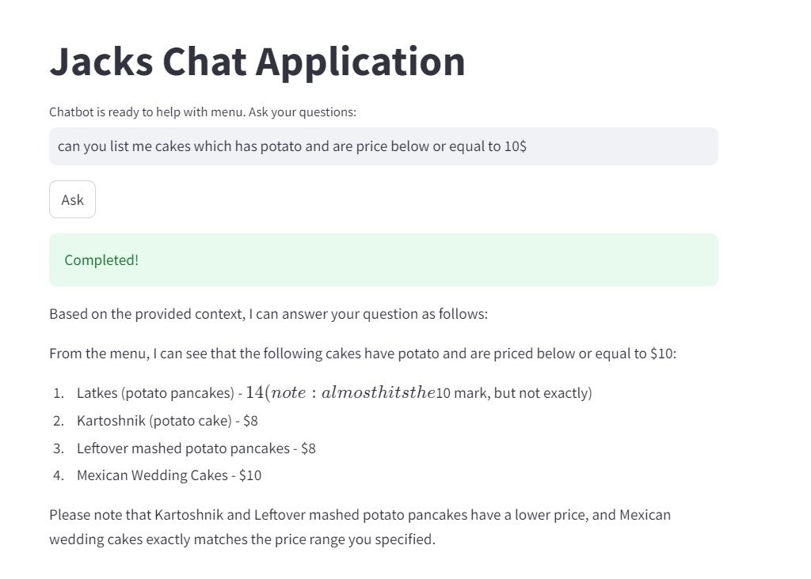

# Restaurant Menu Assistant Chatbot


# Project overview

 Restaurant Menu Assistant is a RAG application which is designed to provide users with detailed information about dishes from a restaurant menu. It answers various questions related to ingredients, calories, nutritional content, reviews, and dishes under certain price etc. The bot utilizes a dataset of menu items and a corresponding question set to generate human-like responses, making it a useful tool for both customers and restaurant management.
 
## Dataset

The main dataset used for this chatbot is located at ```dataset/main_faq_database.json```. 

This dataset was generated by running the script ```dataset/generate_dataset.py``` using the command: 

```bash
python generate_dataset.py
```

The base dataset is a CSV file containing information about various dishes and their details. It includes data on food recipes, such as ingredients, user feedback (ratings and reviews), and nutritional information (like calories and sugar content). This data can be used to analyze user preferences, ingredient usage, or nutritional profiles of different dishes. It is available in the ```dataset/cakes_data.csv``` folder

Here's a breakdown of the key columns and their meanings:

1. id: A unique identifier for the food item or recipe (e.g., 142).

2. name: The name of the dish or recipe (e.g., almond fudge banana cake).

3. ingredients: A list of ingredients used in the recipe, stored as a string representation of a list (e.g., ['dole banana', 'sugar', 'margarine', 'eggs', 'amaretto liqueur', 'vanilla extract']).

4. ingredients_count: The number of ingredients used in the recipe (e.g., 11).

5. user_id: The identifier of the user who rated or reviewed the dish (e.g., 914114).

6. rating: The user's rating of the dish on a scale, possibly from 1 to 5 (e.g., 4).

7. review: A text review provided by the user, giving feedback or details about their experience with the dish (e.g., Came out great for a chocolate Easter cake...).

8. calories: The number of calories in the dish per serving (e.g., 224.8 calories).

9. sugar: The sugar content of the dish, possibly in grams (e.g., 87 grams).

10. calorie_status: A qualitative description of the calorie content, such as whether the dish is considered "Low Calory" (e.g., Low Calory).

11. price: The price associated with the dish, possibly in dollars or another currency (e.g., 24).


## Tech Stack

Python 3.12
Docker and Docker Compose for containerization
Minsearch for full-text search
Web App: Streamlit 
Grafana for monitoring and PostgreSQL as the backend for it
Groq as an LLM

-----

•   Embeddings: Huggingface Transformers (multi-qa-MiniLM-L6-cos-v1) 🤖
•   Vector Store: LanceDB 🗂️
•   Info Retrieval: Tantivy 🔍, Cosine Similarity 🔗, cross-encoder reranker, sentence-window retrieval
•   LLM API: Groq cloud, open ai 
•   Web App: Streamlit 🖥️
•   Deployment: Streamlit Cloud 🌐
•   User Database: MongoDB 📦

## Features

- **Natural Language Interaction**: Communicate with the chatbot in natural language, asking questions about the restaurant menu, dishes, ingredients, and more.
- **Comprehensive Knowledge Base**: The chatbot's knowledge base covers a wide range of menu items and dish details.
- **Streamlit UI**: An intuitive and user-friendly Streamlit interface provides an interactive chat experience.
- **RAG-Powered**: The chatbot utilizes the power of Retrieval Augmented Generation to provide relevant and accurate information tailored to user queries.

## Project Structure

Run the command ```tree /F``` in the project main folder to display the directory structure up to the last element

```plaintext
📂 datatalks-final-project
│
├── .env
├── .env.groq
├── .env.ollama
├── .env.openai
├── .gitignore
├── image-1.png
├── image.png
├── minsearch.py
├── README.md
├── requirements.txt
│
├── 📂 dataset
│   ├── cakes_data.csv
│   ├── generate_dataset.py
│   ├── main_faq_database.json
│   ├── rag-eval-groq-turbo.csv
│   ├── user_questions.json
│   └── 📂 gold_standard_data
│       ├── generate_ground_truth.ipynb
│       └── ground-truth-data.csv
│
├── 📂 fig
│   ├── demo.jpeg
│   └── ui.jpeg
│
├── 📂 menu_assistant
│   ├── app.py
│   ├── data_ingestion.py
│   ├── ingest.py
│   ├── rag.py
│   ├── minsearch.py
│   └── 📂 __pycache__
│       ├── app.py
│       └── minsearch.cpython-312.pyc
│
├── 📂 notebooks
│   ├── minsearch.py
│   ├── min_search_retreival_and_rag_evaluation.ipynb
│   ├── search_results_comparison.csv
│   └── 📂 __pycache__
│       └── minsearch.cpython-312.pyc
│
└── 📂 testing (Please ignore this folder, it was for my testing purpose)
    ├── cakes_data.csv
    ├── demo_es.ipynb
    ├── dish_data.csv
    ├── food_user_qa_dataset.json
    ├── generate_menu_qa_dataset.py
    ├── menu_items.csv
    ├── rag-eval-gpt-3.5-turbo.csv
    ├── sample.json
    ├── user_questions.json
    └── 📂 jack_menu
        ├── jacks_restaurant_data.py
        ├── jacks_restaurant_data_v3.json
        ├── jacks_restaurant_data_v3.py
        └── logo.jpg

```
## Setup Instructions

1. Clone the Repository

```bash
git clone https://github.com/Abhisheknakka/datatalks-final-project.git
cd datatalks-final-project.git
```

2. Install Dependencies
Make sure you have Python 3.8+ installed. Install the required Python packages:

```bash
pip install -r requirements.txt
```


3.1 Environment Variables

This project relies on environment variables to configure API access. You will need to create a .env file in the root of your project directory with the following structure:

Example .env File

```plaintext
# API_HOST can be either 'groq', 'openai', 'ollama':
API_HOST=groq

# Needed for Groq:
GROQ_API_KEY='your groq api key'
GROQ_MODEL=llama3-8b-8192 (my model, you can replace with your model name)

# Needed for OpenAI.com:
OPENAI_API_KEY='your openai api key'
OPENAI_MODEL=gpt-3.5-turbo (my model, you can replace with your model name)

```
#### How to Set Up
Create a .env file in the root of your project directory.
Copy the example provided above into your .env file.
Replace placeholder values with your actual API keys and model names as needed.


3.2 Change the path variable in ```config.py``` file

```plaintext
# change the Base folder path
BASE_FOLDER = 'C:/Users/karth/Documents/datatalks-final-project/'
```

4. Prepare DATA

Open the file 'dataset/gold_standard_truth/generate_ground_truth.py', insert your openai or groq API key there and run the python script.
```bash
python generate_ground_truth.py
```


5. Data Ingestion

Before running the application, you need to perform data ingestion. Run the Python script `menu_assistant/data_ingestion.py` to load the data into the knowledge base.

```bash
cd datatalks-final-project/menu_assistant
python data_ingestion.py
```

6. Retrieval Performance

The basic approach - using minsearch without any boosting - gave the following metrics:
{'hit_rate': 0.5956918981061293, 'mrr': 0.3399384220722044}
Hit rate: 59%
MRR: 33%

The improved version (with tuned boosting):

after boost
```plaintext
     'question': 2.5,       # High priority: users are searching questions
    'dish_name': 1.7,      # Important for matching specific dishes
    'section': 1.2,        # Moderate boost: helps in filtering by category
    'text': 1.3        # Slight boost: could help match answer content} 
```
{'hit_rate': 0.6356870575422037, 'mrr': 0.3578888226192652}

Hit rate: 63%
MRR: 35%

```bash
python scripts/min_search_retreival_and_rag_evaluation.ipynb
```

7. Evaluate RAG Performance

We used the LLM-as-a-Judge metric to evaluate the quality of our RAG flow.

RAG Evaluation Results:

For ```groq```, in a sample with 50 records, we had:

UNKNOWN            0.54
RELEVANT           0.24
PARTLY_RELEVANT    0.14
NON_RELEVANT       0.08

results stored in file ```rag-eval-llama3-8b-8192.csv```


8. Run the Streamlit application
Launch the Streamlit app to interact with the RAG system:

```bash
cd datatalks-final-project/menu_assistant
streamlit run app.py
```



9. Monitoring and User Feedback
There is no dashboard to monitor.

10. Deploted on streamlit cloud ```datatalks-final-project-menu-chatbot.streamlit.app```

## Code

Code
The code for the application is in the ```menu_assistant``` folder:

app.py - the streamlit  application, entry point of the app.
rag.py - the main RAG logic for building the retrieving the data and building the prompt
ingest.py - loading the data into the knowledge base
minsearch.py - an in-memory search engine
db.py - the logic for logging the requests and responses to postgres
db_prep.py - the script for initializing the database


## Disclaimer
This chatbot is for informational purposes only and was created as a project for the LLM Zoomcamp course. The first draft has been submitted, and further work including dashboard and database integration will be completed before the next attempt.

# Reproducibility
This project is fully reproducible. All necessary instructions for running the code, from setting up the environment to executing the scripts, are provided. The dataset used is accessible, and the code is organized for easy execution.

# Dockerization
The project includes a docker-compose for managing dependencies.

the easiest way torun this application is  with 

```bash
docker-compose up
```
if yo udont want to use docker and run locally , you need to manually prepare the environment and install all  the dependencies.

we use `pipenv` for managing dependencies 

Hybrid Search: Implemented and evaluated