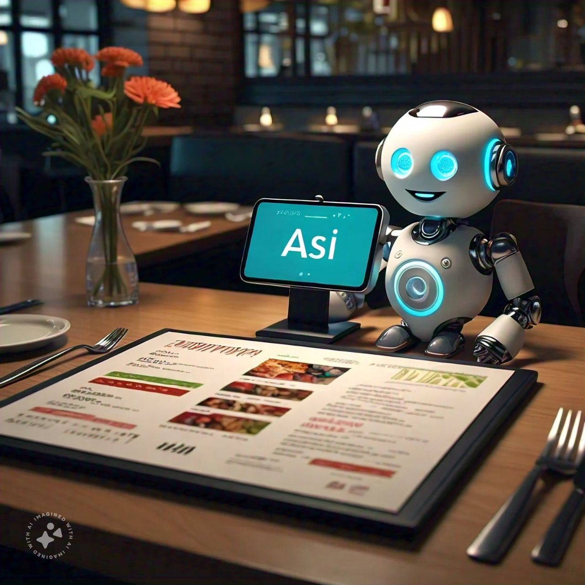

# Restaurant Menu Assistant Chatbot




# Project overview

 Restaurant Menu Assistant is a RAG application which is designed to provide users with detailed information about dishes from a restaurant menu. It answers various questions related to ingredients, calories, nutritional content, reviews, and dishes under certain price etc. The bot utilizes a dataset of menu items and a corresponding question set to generate human-like responses, making it a useful tool for both customers and restaurant management.
 
## Dataset

This dataset provides information about food recipes, including ingredients, user feedback (ratings and reviews), and nutritional data (calories and sugar content). It can be used for analyzing user preferences, ingredient frequency, or nutritional profiles across different dishes. it is available in the "dataset/cakes_data.csv" folder

Here's a breakdown of the key columns and their meanings:

1. id: A unique identifier for the food item or recipe (e.g., 142).

2. name: The name of the dish or recipe (e.g., almond fudge banana cake).

3. ingredients: A list of ingredients used in the recipe, stored as a string representation of a list (e.g., ['dole banana', 'sugar', 'margarine', 'eggs', 'amaretto liqueur', 'vanilla extract']).

4. ingredients_count: The number of ingredients used in the recipe (e.g., 11).

5. user_id: The identifier of the user who rated or reviewed the dish (e.g., 914114).

6. rating: The user's rating of the dish on a scale, possibly from 1 to 5 (e.g., 4).

7. review: A text review provided by the user, giving feedback or details about their experience with the dish (e.g., Came out great for a chocolate Easter cake...).

8. calories: The number of calories in the dish per serving (e.g., 224.8 calories).

9. sugar: The sugar content of the dish, possibly in grams (e.g., 87 grams).

10. calorie_status: A qualitative description of the calorie content, such as whether the dish is considered "Low Calory" (e.g., Low Calory).

11. price: The price associated with the dish, possibly in dollars or another currency (e.g., 24).

## Features

- **Natural Language Interaction**: Communicate with the chatbot in natural language, asking questions about the restaurant menu, dishes, ingredients, and more.
- **Comprehensive Knowledge Base**: The chatbot's knowledge base covers a wide range of menu items and dish details.
- **Streamlit UI**: An intuitive and user-friendly Streamlit interface provides an interactive chat experience.
- **RAG-Powered**: The chatbot utilizes the power of Retrieval Augmented Generation to provide relevant and accurate information tailored to user queries.

## Dataset

In this project, we used the following dataset:
- **Restaurant Menu Dataset**: Available in the `dataset` folder as `main_faq_database.json`.

## Data Ingestion

Before running the application, you need to perform data ingestion. Run the Python script `menu_assistant/data_ingestion.py` to load the data into the knowledge base.

```bash
cd datatalks-final-project/menu_assistant
python data_ingestion.py
```

## How to Use
Initialize the Streamlit application

```bash
cd datatalks-final-project/menu_assistant
streamlit run app.py
```


## Disclaimer
This chatbot is for informational purposes only and was created as a project for the LLM Zoomcamp course. The first draft has been submitted, and further work including dashboard and database integration will be completed before the next attempt.